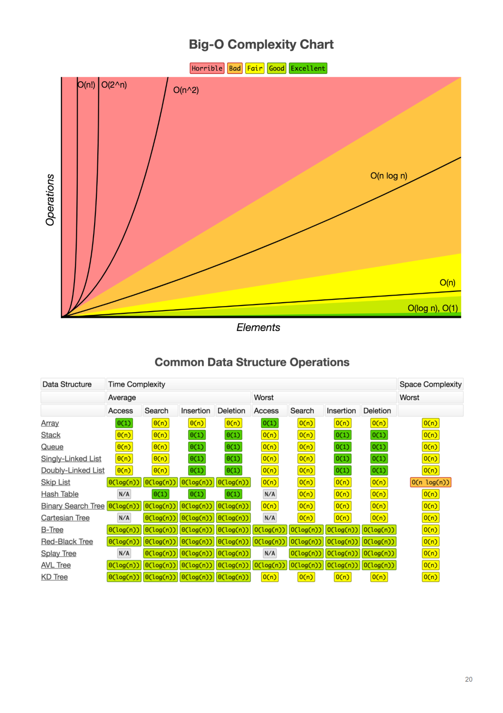

# posters-wallpapers-cheatsheets
Several Posters, Wallpapers and CheatSheets About Programming and More...

## Creative R&D Research Environment

## Disciplined Entrepreneurship:24 Steps to a Successful Startup

## .NET Executable

## Network Communication Protocols

## Linux Networking Tools

## Linux Performance Observability Tools

## Basic Linux Commands 

## T-SQL Join Types

## UML Sample Notation

## Patent and IP

## Computer BS Degree Mapping

## Technical Debt

## Company Outcomes

## Google Sheet CheatSheet

## Machine Learning

## Histomap of Power

